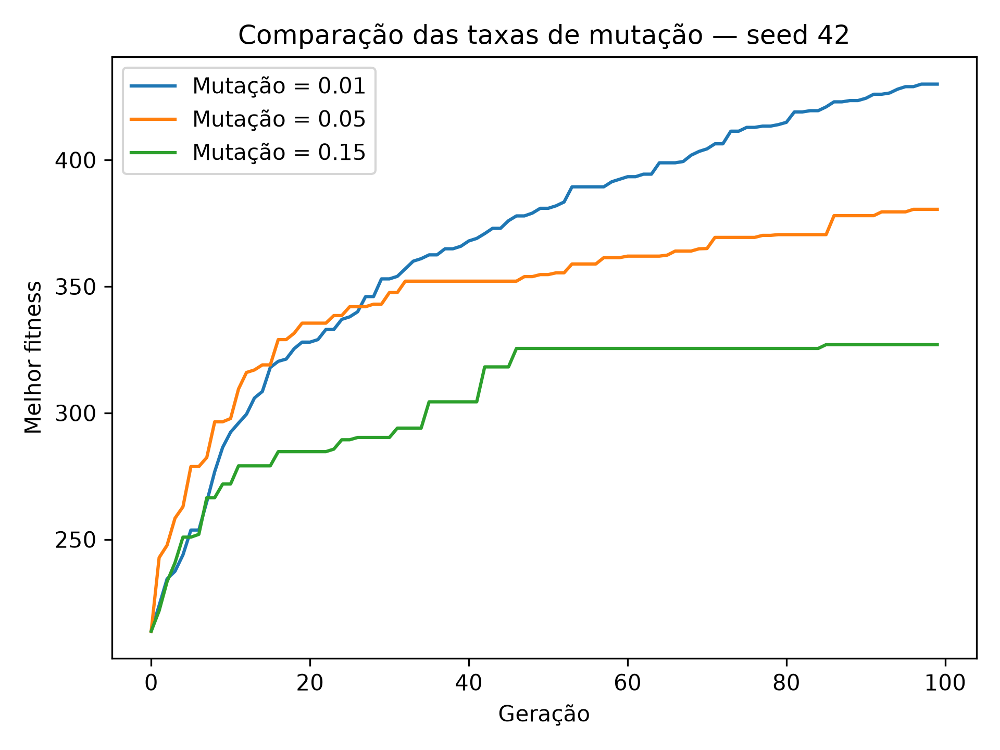

# Geração de blues com algoritmo genético

Projeto de geração musical simbólica para o TP1 de IA Generativa para Música.
O algoritmo genético cria uma melodia de blues de 12 compassos em uma grade
ternária. A música é exportada para MIDI e pode ser convertida para WAV.

## Estrutura

```text
README.md
requirements.txt
main_ternario.py
music_ternario.py
midi_para_wav.py
experimentos.py
test_experimentos.py
resultados_experimentos/
    mutacao_001/   # três MIDIs, três WAVs, gráficos e resultados em JSON
    seeds_001/     # três MIDIs, gráficos e resultados em JSON
```

- `main_ternario.py`: representação, fitness e operadores do algoritmo genético.
- `music_ternario.py`: extração de eventos musicais e exportação MIDI.
- `midi_para_wav.py`: conversão para áudio com FluidSynth.
- `experimentos.py`: comparação de seeds e taxas de mutação.
- `test_experimentos.py`: testes da execução dos experimentos.

## Instalação

Ambiente usado: Python 3.12.3 em Linux. As versões das dependências Python
estão em [requirements.txt](requirements.txt).

Na pasta do projeto:

```bash
python3 -m venv .musica
.musica/bin/python -m pip install -r requirements.txt
```

No Ubuntu, se o módulo `venv` não estiver disponível:

```bash
sudo apt install python3-venv
```

Para converter MIDI em WAV, também são necessários o FluidSynth e um banco
de instrumentos SoundFont. No Ubuntu:

```bash
sudo apt install fluidsynth timgm6mb-soundfont
```

O conversor procura primeiro as ferramentas locais em `.musica/audio` e,
se elas não existirem, usa a instalação do sistema. A pasta `.musica` é
local e não faz parte do repositório. Para apenas ouvir os WAVs já incluídos,
basta um reprodutor de áudio.

## Gerar e ouvir uma música

```bash
.musica/bin/python main_ternario.py
```

O programa usa seed `42`, executa 100 gerações e mostra o diagnóstico do
melhor indivíduo. Salva `melodia_blues_ternario.mid` e
`fitness_evolution_ternario.png` na pasta do projeto. O gráfico também é
exibido em uma janela; feche-a para terminar a execução.

Para converter o MIDI e ouvir no Linux com `pw-play` disponível:

```bash
.musica/bin/python midi_para_wav.py melodia_blues_ternario.mid
pw-play melodia_blues_ternario.wav
```

Também é possível abrir o WAV em outro reprodutor. A conversão gera áudio
a 44.100 Hz. Para escolher outro arquivo de saída ou SoundFont:

```bash
.musica/bin/python midi_para_wav.py melodia_blues_ternario.mid \
    --saida minha_musica.wav --soundfont /caminho/banco.sf2
```

Substitua o caminho do SoundFont por um arquivo existente. A execução normal
substitui seus arquivos MIDI e PNG; a conversão substitui o WAV de destino.
Depois de gerar um novo MIDI, converta-o novamente para atualizar o áudio.

## Representação e algoritmo

Cada indivíduo tem 144 genes: 12 compassos com 12 posições por compasso.
Cada posição dura exatamente 1/3 de tempo, completando 4 tempos por compasso.

| Gene | Significado |
| --- | --- |
| `60` a `72` | Ataque de uma nota MIDI, de C4 a C5. |
| `PAUSA = -1` | Silêncio; encerra a nota ativa. |
| `HOLD = -2` | Prolonga a nota ativa por mais uma posição. |

Por exemplo, `60, HOLD, 67` gera um C4 com duração de 2/3 de tempo seguido
de um G4 com duração de 1/3 de tempo. Repetir o número de uma nota cria
outro ataque. O reparo dos indivíduos substitui sustentações sem nota ativa
por notas válidas. A extração de eventos é compartilhada pelo GA e pelo MIDI.

A melodia é monofônica. A avaliação considera a escala blues de C
(C, Eb, F, F#, G e Bb) e a progressão fixa:

```text
| C7 | F7 | C7 | C7 | F7 | F7 | C7 | C7 | G7 | F7 | C7 | G7 |
```

A população inicial é aleatória. A seleção usa torneios, o elitismo preserva
os melhores indivíduos e o crossover faz cortes entre compassos. A mutação
altera genes para notas, pausas ou sustentações. A execução para após
100 gerações.

| Parâmetro | Valor padrão |
| --- | --- |
| População | 100 |
| Gerações | 100 |
| Tamanho do torneio | 3 |
| Elite | 5 |
| Taxa de crossover | 0,8 |
| Taxa de mutação por gene | 0,05 |
| Probabilidade de pausa | 0,10 |
| Probabilidade de HOLD | 0,20 |

Os parâmetros ficam no início de `main_ternario.py`. O fitness combina
harmonia, movimento, repetição, ritmo, durações, frases, motivos rítmicos e
resolução. Os pesos ficam em `PESOS_FITNESS`; as faixas desejadas de ataques
por compasso ficam em `DENSIDADE_ALVO`. São preferências da avaliação.
O diagnóstico mostra as contribuições dos componentes e as distribuições
de durações, pausas, sustentações e ataques.

### Exportação MIDI

A configuração atual usa piano, andamento de 100 BPM e duas voltas da mesma
melodia, totalizando 24 compassos. O acompanhamento está ativado nas chamadas
de `main_ternario.py` e `experimentos.py`: os acordes são tocados uma oitava
abaixo e com menor intensidade.

Para ouvir somente a melodia, use `acompanhamento=False`. Na execução normal,
as opções ficam na chamada de `exportar_midi()`; nos experimentos, em
`OPCOES_MIDI`. Mantenha as duas configurações iguais para comparar os áudios.

`numero_voltas` controla as repetições. Com acompanhamento,
`finalizar_em_c=True` troca somente o acorde do último compasso da última
volta por C7, sem alterar a melodia nem a progressão usada pelo GA. Sem
acompanhamento, essa opção não afeta o MIDI.

## Experimentos e reprodução dos resultados

```bash
.musica/bin/python experimentos.py seeds
.musica/bin/python experimentos.py mutacao
```

- **Seeds:** usa `42`, `123` e `999`, com mutação `0.05` e os demais parâmetros
  iguais. A seed controla a aleatoriedade; não é um hiperparâmetro do GA.
- **Mutação:** usa taxas `0.01`, `0.05` e `0.15`, reiniciando a seed em `42`
  antes de cada execução. As execuções começam com a mesma população inicial.

Os experimentos são opcionais e não são iniciados pela execução normal nem
pela importação dos módulos. Cada comando cria uma pasta numerada nova em
`resultados_experimentos/`, preservando as anteriores. Como as pastas `_001`
já estão incluídas, a próxima execução cria `_002`.

Cada pasta contém três MIDIs, gráficos individuais e um JSON com indivíduos,
fitness final, históricos, seeds, taxas e configurações de exportação.
O experimento de mutação também salva `comparacao_taxas_mutacao.png`, com
as três curvas de melhor fitness. Os gráficos são salvos sem abrir janelas.

### Músicas incluídas

As três músicas em WAV foram sintetizadas dos MIDIs de `mutacao_001`, com
FluidSynth e o SoundFont TimGM6mb. Todas usam seed 42, duas voltas e acompanhamento.

| Taxa de mutação | MIDI | Áudio WAV | Fitness final |
| --- | --- | --- | --- |
| 0,01 | [mutacao_001.mid](resultados_experimentos/mutacao_001/mutacao_001.mid) | [mutacao_001.wav](resultados_experimentos/mutacao_001/mutacao_001.wav) | 431,00 |
| 0,05 | [mutacao_005.mid](resultados_experimentos/mutacao_001/mutacao_005.mid) | [mutacao_005.wav](resultados_experimentos/mutacao_001/mutacao_005.wav) | 380,50 |
| 0,15 | [mutacao_015.mid](resultados_experimentos/mutacao_001/mutacao_015.mid) | [mutacao_015.wav](resultados_experimentos/mutacao_001/mutacao_015.wav) | 327,00 |



Os resultados do experimento de seeds estão em
[resultados_seeds.json](resultados_experimentos/seeds_001/resultados_seeds.json):

| Seed | Taxa de mutação | Fitness final |
| --- | --- | --- |
| 42 | 0,05 | 380,50 |
| 123 | 0,05 | 389,80 |
| 999 | 0,05 | 389,90 |

Essas pontuações descrevem as execuções salvas. Um fitness maior indica maior
pontuação nas heurísticas usadas; a qualidade musical também depende da escuta.
O histórico atual registra as populações antes da reprodução de cada geração.
Por isso, a última população retornada não aparece na curva: para mutação
`0.01`, o gráfico termina em 430 e o fitness final é 431.

Para converter os três MIDIs incluídos novamente:

```bash
.musica/bin/python midi_para_wav.py resultados_experimentos/mutacao_001/mutacao_001.mid
.musica/bin/python midi_para_wav.py resultados_experimentos/mutacao_001/mutacao_005.mid
.musica/bin/python midi_para_wav.py resultados_experimentos/mutacao_001/mutacao_015.mid
```

Para ouvir uma música:

```bash
pw-play resultados_experimentos/mutacao_001/mutacao_001.wav
```

Os mesmos comandos servem para novos resultados, ajustando o caminho da pasta.

## Testes

```bash
.musica/bin/python -m unittest test_experimentos -v
```

Os nove testes verificam a parametrização da mutação, o uso das seeds,
a exportação dos resultados, os gráficos e a preservação de execuções anteriores.

## Uso de IA

Foi utilizado ChatGPT/Codex como apoio na discussão da representação musical,
revisão de trechos de código, integração da exportação MIDI e
conversão para WAV, testes e documentação.

Conversa compartilhada:
[registro do apoio de IA](https://chatgpt.com/share/6ac80496-0c98-83e8-a408-86b38bd24d3f).
